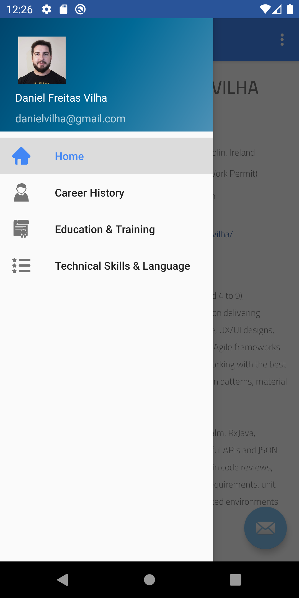
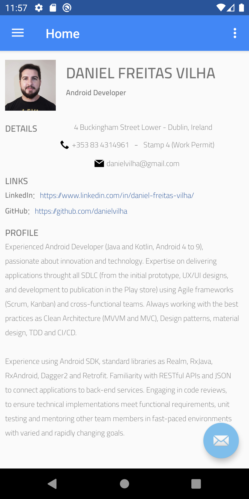
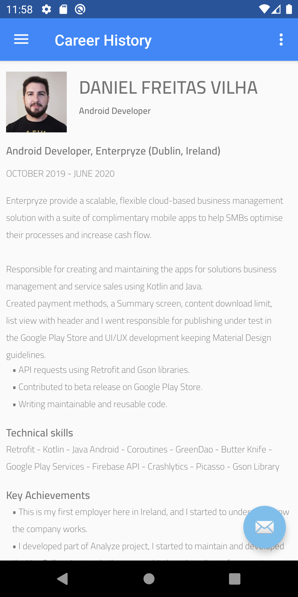
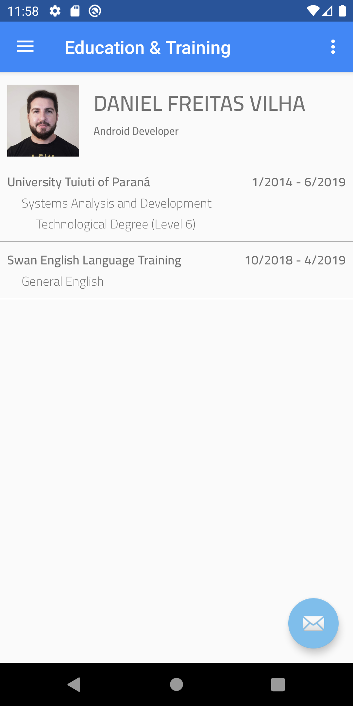
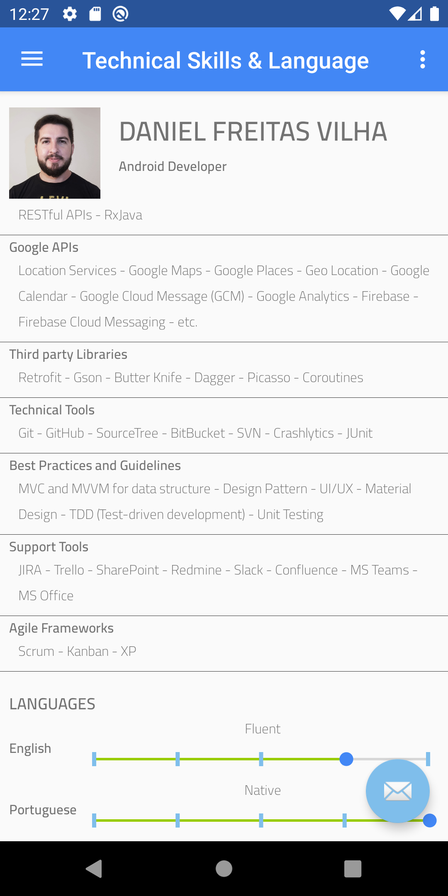

# CV App Android
This is an app I'm developing for showing my CV.


### Overview
This is an app to view the CV. (I need to improve this overview)


### Screenshots
Menu | Home Screen | Career History | Education & Training | Technical Skills & Language
--- | --- | --- | --- | ---
 |  |  |  | 


### More Features to implement
- [ ] I need to implement the service, now I put a JSON file in the app.
- [ ] When I finish implementing the service, I want to put some tests.
- [ ] I want to improve the viewing of the app.
- [ ] I need to change the floating button, because I didn't like how it looks.


## Licence
Copyright 2020 Daniel Freitas Vilha
```
Permission is hereby granted, free of charge, to any person obtaining a copy
of this software and associated documentation files (the "Software"), to deal
in the Software without restriction, including without limitation the rights
to use, copy, modify, merge, publish, distribute, sublicense, and/or sell copies
of the Software, and to permit persons to whom the Software is furnished to do so,
subject to the following conditions:

The above copyright notice and this permission notice shall be included in all
copies or substantial portions of the Software.

THE SOFTWARE IS PROVIDED "AS IS", WITHOUT WARRANTY OF ANY KIND, EXPRESS OR
IMPLIED, INCLUDING BUT NOT LIMITED TO THE WARRANTIES OF MERCHANTABILITY,
FITNESS FOR A PARTICULAR PURPOSE AND NONINFRINGEMENT. IN NO EVENT SHALL
THE AUTHORS OR COPYRIGHT HOLDERS BE LIABLE FOR ANY CLAIM, DAMAGES OR OTHER
LIABILITY, WHETHER IN AN ACTION OF CONTRACT, TORT OR OTHERWISE, ARISING FROM,
OUT OF OR IN CONNECTION WITH THE SOFTWARE OR THE USE OR OTHER DEALINGS IN THE
SOFTWARE.
```
